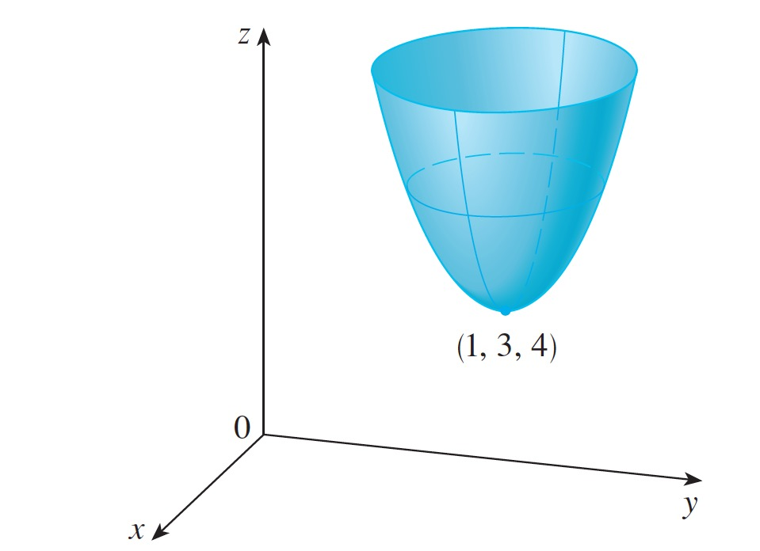

# Simple Gradient Descent

A simple implementation of the gradient descent technique to find a minimum on a 3d elliptic paraboloid.

I build this program , since I spend the last couple of days trying to grasp how exactly the gradient descent
optimization technique works.

I came to a conclusion: The key aspect of gradient descent is how to interpret the gradient, or the slope as it is called.
In this implementation, the goal is to find the minimum x and y value pair on the below shown 3d elliptic paraboloid. It is also expected that you have some familiarity with differential calculus.
The graph is determined by the following function:  

f(x, y) = x^2 + y^2 - 2x - 6y + 14

With partial differentiation: 

The derivative of f with respect to x is: df/dx = 2x - 2 , since y is treated as a constant.

The derivative of f with respect to y is : df/dy = 2y - 6 , since x is treated as a constant.

For the gradient descent to work properly we need to define a learning rate and a number of iterations.
We have:

Learning rate = 0.001, number of iterations = 10000

To begin we start of at x = 0 and y = 0, which gives the corresponding f(0, 0) = 14.
We calculate the corresponding gradients, df/dx = -2, df/dy = -6. This tells us that the slope we started at
is negative and the minimum is therefore ahead of us.

We then proceed to update values of x and y, notice that we are subtracting from the starting x or y value. This is done since a negative slope tells us that we need to add to the x or y value and we must remember that subtracting a negative value is the same as addition. This makes equally good sense if we have a positive slope, then we know that we have passed the minimum and we then have to subtract from the given x or y value.

updated_x = x - (df/dx * learningRate)

updated_y = y - (df/dy * learningRate)

The learning rate is there to make sure that we don't take to big steps towards the minimum. We want to make
sure not to overshoot it. 

This process is then repeated a fitting number of times. Each time the new and updated x and y values are fed back into the loop. Eventually we arrive at the minimum.

